# Installing TortoiseGIT

To use TortoiseGIT and get the easy to use context menus, there are a few step you need to do. You will need an adminstrator access to install these. This guide was written with Git for Windows 2.18.0 *(as of Jan 2019, 2.20.1 is the latest)* and TortoiseGit 2.7.0, if using a different version, you might see different options but for the most part we will use the default options.

## Install [Git for Windows](https://git-scm.com/download/win)

* Visit <https://git-scm.com/download/win> and it should start to download the latest version. 

* Launch the installer

    

* Accept the GNU General Public License V2, by clicking *Next*

    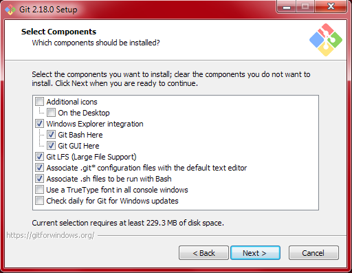

* You can leave the default components. Maybe you want to use TrueType font in all console windows if you like pretty fonts. And you may want to have it check for daily updates for Git for Windows if you'd like. 

    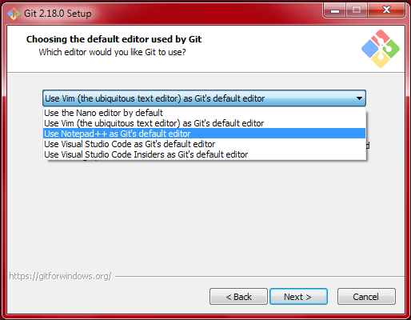

* Select your editor to use. If you have no experience with it, Vim is an awkward editor. If you have Visual Studio Code, or Notepad++, you may want to select that. If you have experience with nano, you may like to select that.

    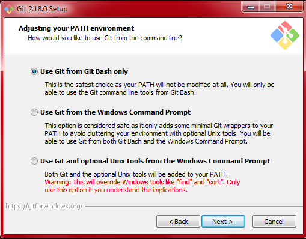

* You can leave *Use Git from Git Bash only* unless you expect to use the Command Prompt for issuing Git commands directly.

    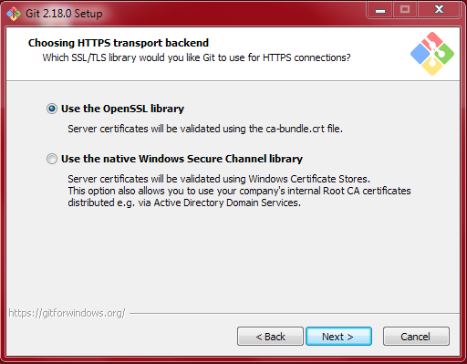

* You can also leave *Use the OpenSSL library*.

    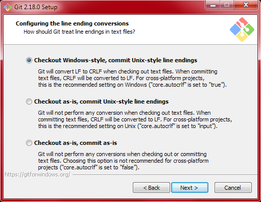

* You can leave the *Checkout Windows-style, commit Unix-style line endings*. This way, when you edit in Windows, line breaks will appear correct, and then when they are committed, they appear normal for Linux and Mac users.

    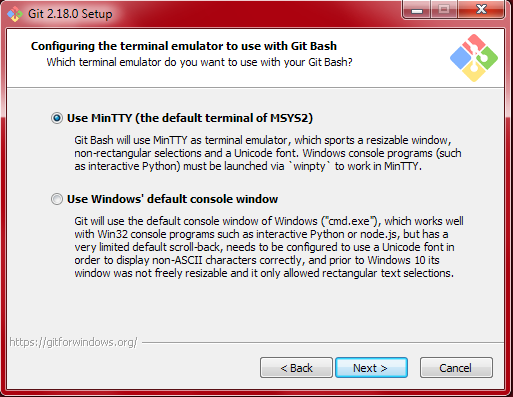

* You can leave the *Use MinTTY (the default terminal for MSys2)* 

    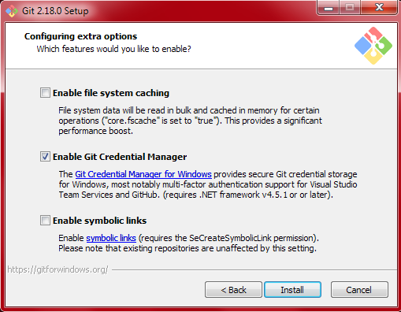

* And, you can leave the *Enable Git Credential Manager* and finally hit *Install* 

    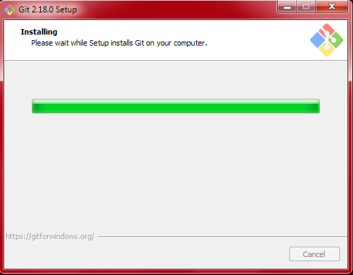

* Sit back and wait for it to complete! 

    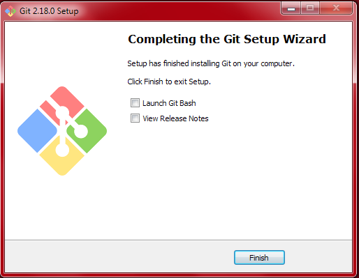

* You are done! You don't need to *View Release Notes* or *Launch Git Bash*

## Install [TortoiseGIT](https://tortoisegit.org/)

* Visit <https://tortoisegit.org/download/> and select the appropriate version for your computers (either 32-bit or 64-bit)

    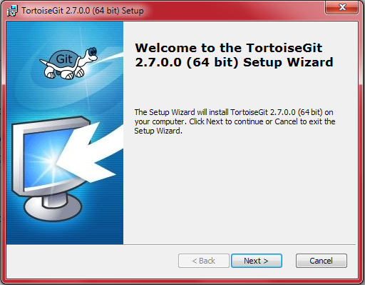

* Click *Next* and start going!

    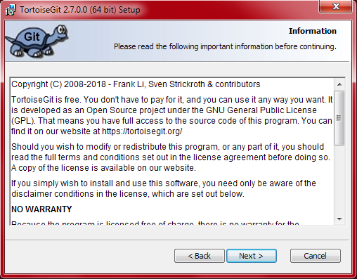
    
* Read the entire license and accept by clicking *Next*!

    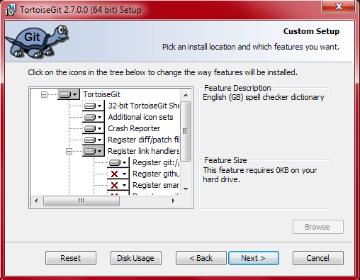
    
* The default options are fine. You may want to choose to not install the *English (GB) dictionary* if you are pressed for 40KB of hard drive space

    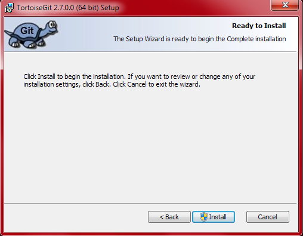
    
* Now, just click *Install*, if you are not an administrator, now it will ask for the administrator's password

    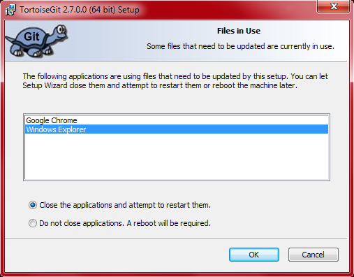
    
* Wait for it to install. At first, it may seem like nothing is happening, but after several seconds, the progress bar should start moving. If you had a previous version of TortoiseGit, you may get a message that it has to shut down Windows Explorer.

    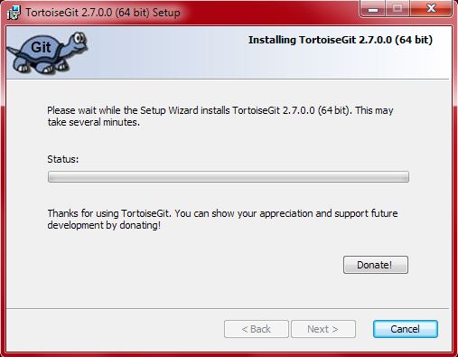
    
* And then wait a little bit...

    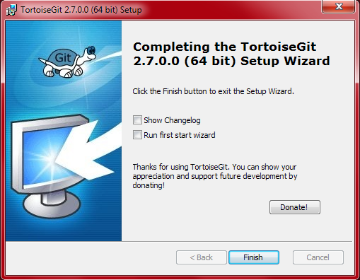
    
* That's all folks! You can now Git away until your heart's content with TortoiseGit! You don't have to *Show Changelist* if you want.

